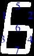

# Segment Digit Recognition

Пакет для обнаружения и распознования цифр.


Зависимости
* python 3.7+
* [opencv](https://pypi.org/project/opencv-python/)
* [numpy](https://pypi.org/project/numpy/)

---------

## Использование

Для анализа папки с изображениями:

```
def get_digits_from_photos(path_to_dir):
    digits = []
    files = sorted(
        os.listdir(path_to_dir), 
        key=lambda filename: int(filename[:filename.rfind('.')])
        )

    for filename in files:
        path_to_file = os.path.join(path_to_dir, filename)
        if os.path.isfile(path_to_file):
            image = cv2.imread(path_to_file)
            sdr = SDR(image)
            digits.append([filename, sdr.identify_and_get_digits()])

    return digits


def main():
    directory = '...'
    print(*get_digits_from_photos(directory), sep='\n')

```

## Основные


### SDR - Segment Digit Recognizer

**segment_digit_recognition.py**

Объединяет нижеперечисленные классы

Распознаёт цифры на изображении с дисплеями

**print_codes=True**: печатает коды неопределенных цифр

```
image = cv2.imread(path_to_file)
sdr = SDR(image, print_codes=True)
print(sdr.identify_and_get_digits())
```


### DisplayDetector
**detection.py**

Ищет дисплеи в определённом HSV диапазоне

По умолчанию ищет в красном диапазоне


```
hsv_ranges = [                               
	((0, 100, 30), (10, 255, 255)),                               
	((175, 0, 40), (180, 255, 255))                               
]  
frames_of_displays = DisplayDetector(image_of_display, hsv_ranges).search_and_get_frames()
```

### DigitDetector
**detection.py**

Ищет цифры на изображении дисплея

```
frames_of_digit = DisplayDetector(image_of_display).search_and_get_frames()
```

### DigitRecognizer
**digit_recognition.py**

Распознаёт цифру по пороговому изображению

<details><summary>Как это работает?</a></summary>

1) DigitRecognizer вырезает линии пикселей - отмечены синим на рис.1.
2) В случае горизонтальных линий режет их на две равных части, в случае горизонтальных линий режет их на три части в соотношении 1:2:1.
3) После этого считает количество подряд идущих пикселей в кусках среза. Если count >= threshold, то данная зона имеет код 1, иначе 0.
4) Из срезов собирается полный код цифры и находится цифра. (Номер зоны это цифра в коде, рис.2)
5) Цифры сегментных дисплеев имеют наклон, поэтому в случае цифры семь 7-ой код будет 1 хотя это неверно. (рис. 3) Поэтому вместо одного среза делается два в зонах 40% и 60% от ширины, после коды обоих срезов объединяются в один. (рис. 4)

```
    digit_codes = {
        "0101000": 1,
        "0110111": 2,
        "0101111": 3,
        "1101010": 4,
        "1001111": 5,
        "1011111": 6,
        "0101100": 7,
        "1111111": 8,
        "1101111": 9,
        "1111101": 0,
    }
```
 
<div style='width:100%; display: flex; justify-content:space-around;'>





</div>

</details>

<br>

```
_, threshold_image = cv.threshold(image_of_digit, 0, 255, cv.THRESH_OTSU)
digit = DigitRecognizer(threshold_image).define_and_get_digit()
```

## Вспомогательные

### ImageCutter
**image_cutting.py**

Вырезает изображения по границам

Иногда при вырезании некоторые пиксели обрезаются, поэтому границы следует немного увеличить.

```
increase_in_width, increase_in_height = 3, 6 # by default
DigitDetector = self.DigitDetector(image_of_display)                               
DigitDetector.search_frames()                               
frames_of_digits = DigitDetector.get_increased_frames(increase_in_width, increase_in_height)                               
images = self.ImageCutter(DigitDetector.threshold_image).get_images_by_frames(frames_of_digits)

# or

frames_of_digits = DigitDetector(image_of_display).search_and_get_frames()
images = self.ImageCutter(DigitDetector.threshold_image).get_images_by_frames(frames_of_digits)
```
